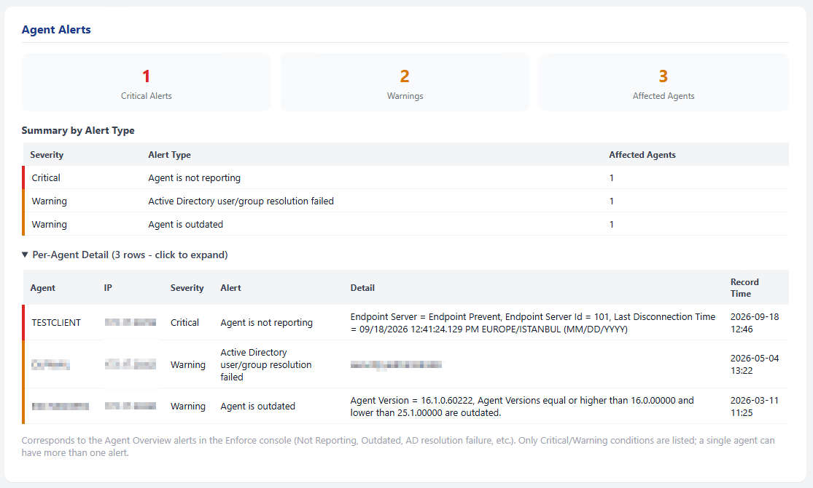
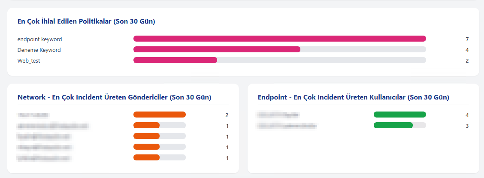
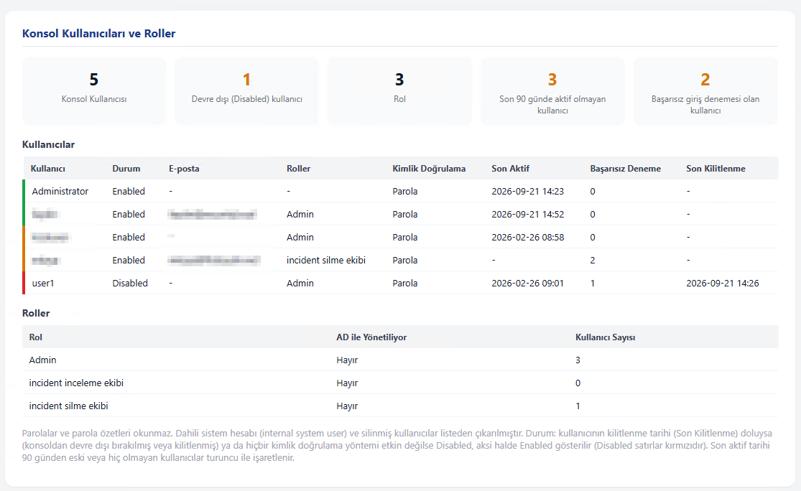
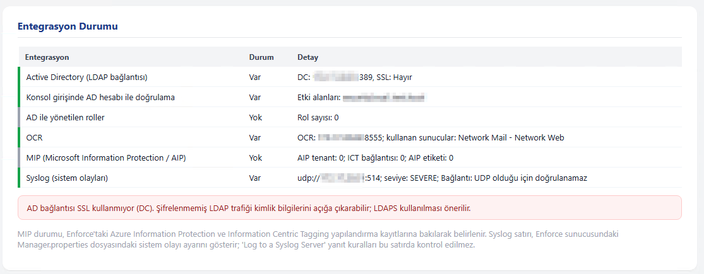
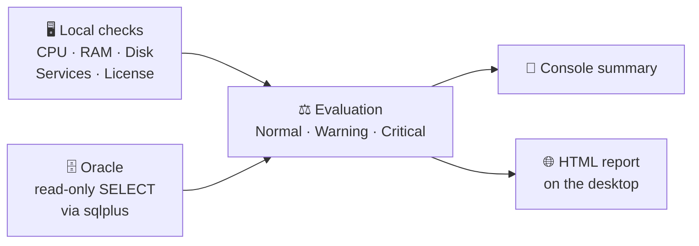

&nbsp;
<h1 align="center">🛡️ DLP Server Health</h1>

<h3 align="center">Is your DLP system really healthy? Find out in a few minutes.</h3>

<p align="center">
  A free, open-source, single-file and <b>read-only</b> health check script for Symantec / Broadcom DLP.
</p>

<p align="center">
  🇬🇧 English | <a href="README.md">🇹🇷 Türkçe</a>
</p>

<p align="center">
  <a href="#-quick-start">Quick Start</a> |
  <a href="#-sample-report">Sample Report</a> |
  <a href="#-what-does-it-check">What It Checks</a> |
  <a href="#-security-what-the-script-does-and-does-not-do">Security</a> |
  <a href="#️-usage-examples">Usage</a> |
  <a href="../../issues">Feedback</a>
  <br/><br/>
  
  
  
  
</p>

<p align="center">
  
</p>

<hr/>

**DLP Server Health** is a PowerShell script that runs on the Enforce Server. It checks server resources, DLP services and the DLP database on Oracle **by reading only**, prints a summary to the console and generates a graphical HTML report on the desktop.

No installation required. It changes nothing on the system and sends no data out.

Author: **FIRAT AYDIN**

> [!NOTE]
> The report and console output are currently in **Turkish**. The screenshots below show the Turkish report.

- [Quick start](#-quick-start)
- [Sample report](#-sample-report)
- [Read before you run](#️-read-before-you-run)
- [What does it check?](#-what-does-it-check)
- [Security: what the script does and does not do](#-security-what-the-script-does-and-does-not-do)
- [How it works](#-how-it-works)
- [Requirements](#-requirements)
- [Usage examples](#️-usage-examples)
- [Feedback and disclaimer](#-feedback)

---

## ⚡ 30-second summary

| | |
|---|---|
| **What does it do?** | Reads and reports the state of the DLP server and its Oracle database |
| **What does it change?** | **Nothing.** Read-only (`SELECT`) |
| **Output** | Console summary + graphical HTML report on the desktop (plus a matching PDF, auto-generated if Edge/Chrome is present) |
| **Where does it run?** | Enforce Server (Windows) |
| **How long does it take?** | A few minutes |

---

## 🚀 Quick start

**1.** Copy the script to the Enforce Server.

**2.** Open PowerShell as Administrator and run:

```powershell
.\DlpServerHealth.ps1
```

**3.** The script asks the following, answer in order:

| Question | Example |
|---|---|
| Customer name *(can be left empty)* | `Example Corp` |
| Architecture: `2` (two-tier) / `3` (three-tier) / `B` (don't know) | `3` |
| Oracle host / IP | `10.0.0.5` |
| Oracle user and service name | `protect` / `protect` |
| Oracle password *(input is hidden)* | `********` |

**4.** When it finishes, open `<CustomerName>_DLPHC_<date>.html` on your desktop. If Microsoft Edge or Google Chrome is present, a matching `.pdf` copy is generated automatically. ✅

> [!TIP]
> To run only the server checks without connecting to the database: `.\DlpServerHealth.ps1 -SkipDatabaseCheck`

> [!TIP]
> The PDF report does not include the per-agent detail list from the HTML report — only the critical/warning summary. The full list is always available in the HTML report. If Edge or Chrome is not found, the PDF step is skipped and the HTML report is still generated.

---

## 📸 Sample report

Sections of the HTML report the script writes to the desktop. All server names and IP addresses are blurred.

**Overview and health findings**


**Hardware comparison and DLP services**


**Agent distribution and Detection Server status**


<details>
<summary><b>More screenshots (click to expand)</b></summary>

<br/>

**Detection Server error and warning events**


**Agent alerts (collapsible list for large environments)**



**Incident count, distributions and policy summary**


**Most violated policies, senders and users**



**Console users and roles**



**Integration status (AD, OCR, MIP, Syslog)**



> The same report is also generated automatically as a PDF alongside the HTML file (see [Quick start](#-quick-start)).

</details>

---

## ⚠️ Read before you run

> [!IMPORTANT]
> Use it only on systems you are **authorized** to access. Try it in a **test environment** first.

> [!WARNING]
> **The password may be visible on the command line.**
> `sqlplus.exe` takes the connection details as a command-line argument. While the script runs, another privileged user logged on to the same machine could see it.
> **Fix:** Use a dedicated Oracle account with **read-only** privileges for this purpose.

> [!WARNING]
> **The report contains corporate data.**
> Policy names, server names, sender / user information and incident counts end up in the report. Review it before sharing.

> [!NOTE]
> **Syslog connectivity test.** If syslog is enabled in `Manager.properties`, the script **only tries to open a TCP connection** to that server (3-second timeout, no data is sent). Use `-SkipSyslogConnectivityTest` if you do not want this. UDP cannot be tested.

> [!NOTE]
> **Version differences are possible.** The queries were written for specific DLP schema versions. Some sections may be empty on other versions. On the first run, compare the results with the Enforce console.

---

## 🔍 What does it check?

| Area | What is checked |
|---|---|
| 🖥️ **Server** | CPU, RAM, disk, comparison with Broadcom hardware recommendations, architecture consistency |
| ⚙️ **Services** | DLP Windows services, system events |
| 🔑 **License** | Valid / expiring soon / expired |
| 📡 **Detection Server** | Version, Running / Unknown state |
| 💻 **Endpoint agents** | Count and version distribution |
| 🚨 **Agent alerts** | Not Reporting, Outdated, AD resolution failure, etc. (Enforce Agent Overview); collapsible list for large environments |
| 🗄️ **Oracle** | Version, tablespace usage |
| 📊 **Incidents** | Top 10 by type, server, policy, sender, user; incidents pending deletion |
| 📋 **Policies** | Total, groups, policies with no incidents, pattern summary |
| 👥 **Console access** | Users, roles, inactive accounts |
| 🔗 **Integrations** | AD, OCR, MIP, Syslog setting and reachability for system events |

---

## 🔐 Security: what the script does and does not do

| ✅ Does | ❌ Does not |
|---|---|
| Sends only `SELECT` to Oracle | Run `INSERT` / `UPDATE` / `DELETE` / `DROP` |
| Asks for the password masked and clears it from memory after use | Write the password to disk |
| Keeps data on the local machine | Send any data out (no internet, cloud or e-mail) |
| Deletes temporary files when done | Read console users' password fields |
| Is fully open source | Contain anything hidden or embedded |

Temporary files are written under `C:\ProgramData\DlpHealthTemp` and deleted when the run finishes.

---

## 🧠 How it works



1. **Local checks:** CPU, RAM, disk, DLP services, system events and license files are read.
2. **Oracle checks:** Only read queries are run through `sqlplus.exe`.
3. **Evaluation:** Each finding is marked **Normal / Warning / Critical** against thresholds.
4. **Report:** A summary is printed to the console and an offline HTML file with no external libraries is written to the desktop.

---

## 📋 Requirements

- Windows PowerShell **5.1+**
- `sqlplus.exe` on the Enforce Server (in `PATH`)
- Network access from Enforce to Oracle (default port `1521`)
- Preferably an Oracle user with **read-only** privileges
- *(Optional)* Microsoft Edge or Google Chrome for the PDF output — if neither is present, only the HTML report is generated, with no error

---

## 🎛️ Usage examples

```powershell
# Interactive (recommended)
.\DlpServerHealth.ps1

# Provide customer name and architecture up front
.\DlpServerHealth.ps1 -CustomerName "Example Corp" -DeploymentTier ThreeTier

# Server checks only, no database connection
.\DlpServerHealth.ps1 -SkipDatabaseCheck

# Change thresholds
.\DlpServerHealth.ps1 -CpuWarningPercent 75 -DiskCriticalFreePercent 8
```

<details>
<summary><b>📑 All parameters (click to expand)</b></summary>

<br/>

| Parameter | Default | Description |
|---|---|---|
| `-CustomerName` | empty | Report title |
| `-DeploymentTier` | asks | `TwoTier`, `ThreeTier`, `Unknown` |
| `-DatabaseHost` | `x.x.x.x` | Oracle host / IP |
| `-DatabasePort` | `1521` | Oracle port |
| `-DatabaseServiceName` | `protect` | Oracle service name |
| `-DatabaseUser` | `protect` | Oracle user |
| `-IncidentLookbackDays` | `30` | Look-back period for incident analysis (days) |
| `-IncidentTopCount` | `10` | Number of entries in Top lists (max 10) |
| `-CpuWarningPercent` / `-CpuCriticalPercent` | `70` / `85` | CPU thresholds |
| `-MemoryWarningUsedPercent` / `-MemoryCriticalUsedPercent` | `80` / `90` | RAM thresholds |
| `-DiskWarningFreePercent` / `-DiskCriticalFreePercent` | `20` / `10` | Free disk thresholds |
| `-SkipDatabaseCheck` | off | Skips Oracle checks |
| `-SkipSyslogConnectivityTest` | off | Skips the TCP connectivity test to the syslog server |

</details>

<details>
<summary><b>🔎 Known limitations (click to expand)</b></summary>

<br/>

- **Detection Server status** is derived from heartbeat. When the signal stops, the console shows "Unknown", so the report shows "Unknown" too. "Stopped" cannot be told apart.
- **License information** is read from the `.slf` files on the Enforce server, not from the database. If the files are in a different path, this section may be empty.
- **The two-tier hardware comparison** is calculated. Broadcom does not publish a separate table for two-tier, so the Enforce and Oracle recommendations are added together. The report states this.
- **Deleted incidents** cannot be counted from the database. The report shows active incidents and those pending deletion.
- **Tablespace usage** does not take autoextend / `MAXBYTES` limits into account. A tablespace with autoextend enabled may look more critical than it is.
- **The PDF report** does not include the HTML report's per-agent detail list (only summary KPIs and the by-alert-type table). The full list is always available in the HTML report. If Edge/Chrome is not found, the PDF step is silently skipped.
- Designed only for a **Windows Enforce Server**. Not all DLP versions and architecture variations have been tested.

</details>

---

## 🤝 Feedback

Please share bugs, suggestions and **your test results on different DLP versions** as an [Issue](../../issues). Contributions are welcome.

## ⚖️ Disclaimer

This script is provided **as is**, without any warranty. Use it only on systems you are authorized to access. Before running it in production, review the source code and try it in a test environment. The user is responsible for any consequences of its use.

---

<div align="center">

**FIRAT AYDIN**

</div>
