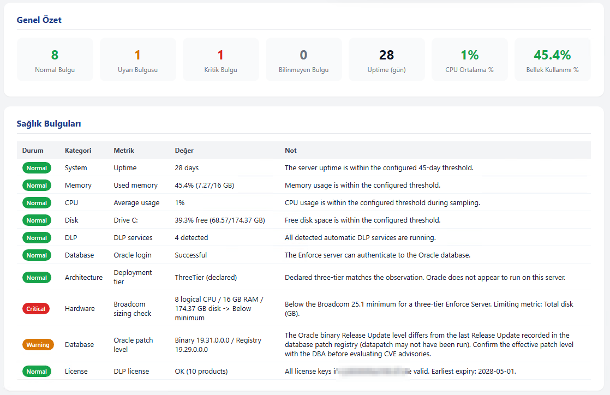
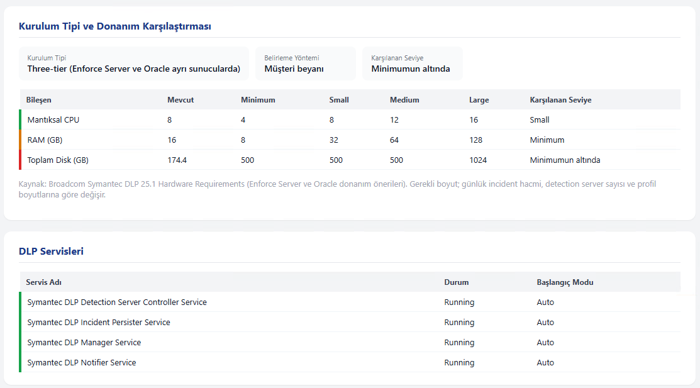
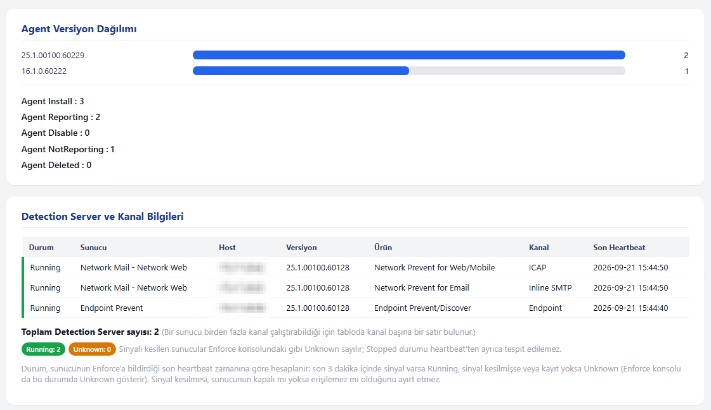
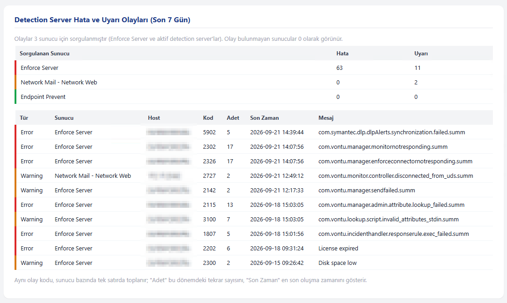
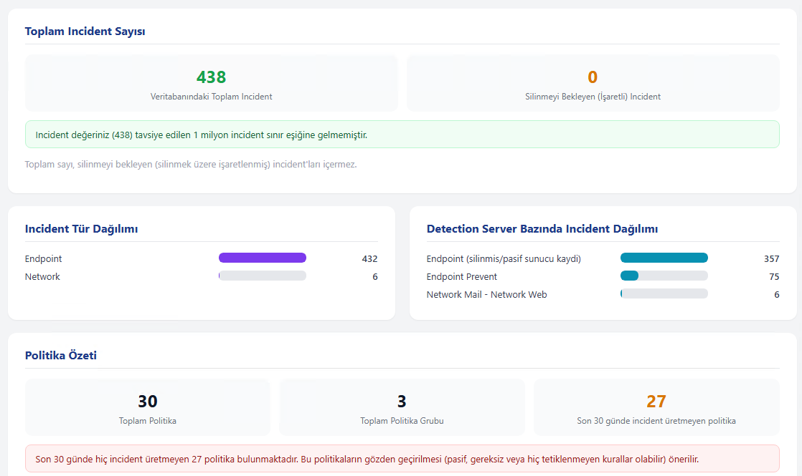
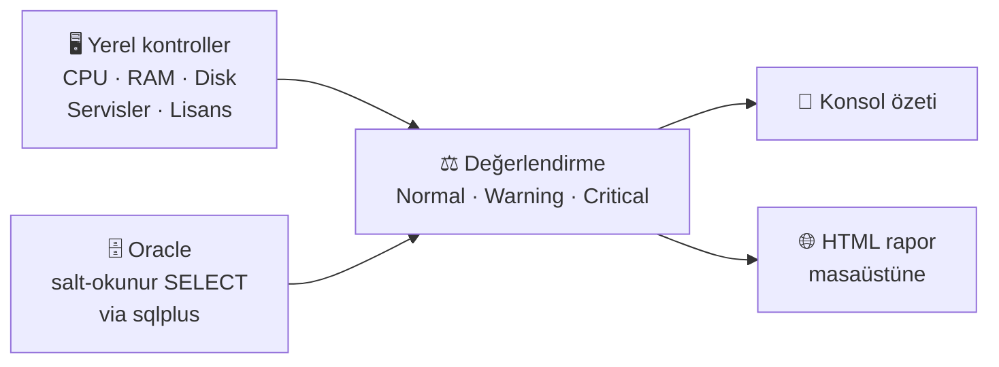

&nbsp;
<h1 align="center">🛡️ DLP Server Health</h1>

<h3 align="center">DLP sisteminiz gerçekten sağlıklı mı? Cevabı birkaç dakikada alın.</h3>

<p align="center">
  Symantec / Broadcom DLP için ücretsiz, açık kaynak, tek dosyalık ve <b>salt-okunur</b> sağlık kontrolü script'i.
</p>

<p align="center">
  <a href="#-hızlı-başlangıç">Hızlı Başlangıç</a> |
  <a href="#-örnek-rapor-çıktısı">Örnek Rapor</a> |
  <a href="#-neleri-kontrol-eder">Neleri Kontrol Eder</a> |
  <a href="#-güvenlik-script-ne-yapar-ne-yapmaz">Güvenlik</a> |
  <a href="#-kullanım-örnekleri">Kullanım</a> |
  <a href="../../issues">Geri Bildirim</a>
  <br/><br/>
  
  
  
  
</p>

<p align="center">
  
</p>

<hr/>

**DLP Server Health**, Enforce Server üzerinde çalışan bir PowerShell script'idir. Sunucu kaynaklarını, DLP servislerini ve Oracle üzerindeki DLP veritabanını **sadece okuyarak** kontrol eder, konsola özet basar ve masaüstüne grafikli bir HTML rapor üretir.

Kurulum gerektirmez, sistemde hiçbir şeyi değiştirmez, dışarıya veri göndermez.

Hazırlayan: **FIRAT AYDIN**

- [Hızlı başlangıç](#-hızlı-başlangıç)
- [Örnek rapor çıktısı](#-örnek-rapor-çıktısı)
- [Çalıştırmadan önce mutlaka okuyun](#️-çalıştırmadan-önce-mutlaka-okuyun)
- [Neleri kontrol eder?](#-neleri-kontrol-eder)
- [Güvenlik: script ne yapar, ne yapmaz?](#-güvenlik-script-ne-yapar-ne-yapmaz)
- [Nasıl çalışır?](#-nasıl-çalışır)
- [Gereksinimler](#-gereksinimler)
- [Kullanım örnekleri](#️-kullanım-örnekleri)
- [Geri bildirim ve sorumluluk reddi](#-geri-bildirim)

---

## ⚡ 30 saniyede özet

| | |
|---|---|
| **Ne yapar?** | DLP sunucusunun ve Oracle veritabanının durumunu okur, raporlar |
| **Neyi değiştirir?** | **Hiçbir şeyi.** Sadece okur (`SELECT`) |
| **Çıktısı ne?** | Konsola özet + masaüstüne grafikli HTML rapor |
| **Nerede çalışır?** | Enforce Server (Windows) |
| **Ne kadar sürer?** | Birkaç dakika |

---

## 🚀 Hızlı başlangıç

**1.** Script'i Enforce Server'a kopyalayın.

**2.** PowerShell'i yönetici olarak açıp çalıştırın:

```powershell
.\DlpServerHealth.ps1
```

**3.** Script sırayla şunları sorar, cevaplayın:

| Soru | Örnek |
|---|---|
| Müşteri adı *(boş bırakılabilir)* | `Ornek A.S.` |
| Mimari: `2` (two-tier) / `3` (three-tier) / `B` (bilmiyorum) | `3` |
| Oracle host / IP | `10.0.0.5` |
| Oracle kullanıcı ve servis adı | `protect` / `protect` |
| Oracle parolası *(yazarken görünmez)* | `********` |

**4.** Bitince masaüstünde `<SunucuAdı>_DLP_HC_<tarih>.html` dosyasını açın. ✅

> [!TIP]
> Veritabanına bağlanmadan sadece sunucu kontrolü yapmak için: `.\DlpServerHealth.ps1 -SkipDatabaseCheck`

---

## 📸 Örnek rapor çıktısı

Script'in masaüstüne ürettiği HTML raporundan bölümler. Tüm sunucu adları ve IP bilgileri bulanıklaştırılmıştır.

**Genel özet ve sağlık bulguları**


**Donanım karşılaştırması ve DLP servisleri**



**Agent dağılımı ve Detection Server durumu**



<details>
<summary><b>Daha fazla ekran görüntüsü (açmak için tıklayın)</b></summary>

<br/>

**Detection Server hata ve uyarı olayları**



**Incident sayısı, dağılımlar ve politika özeti**



</details>

---

## ⚠️ Çalıştırmadan önce mutlaka okuyun

> [!IMPORTANT]
> Sadece **yetkili olduğunuz** sistemlerde kullanın. İlk denemeyi **test ortamında** yapın.

> [!WARNING]
> **Parola komut satırında görünebilir.**
> `sqlplus.exe` bağlantı bilgisini komut satırı argümanı olarak alır. Script çalışırken aynı makinede oturum açmış yetkili bir kullanıcı bunu görebilir.
> **Çözüm:** Bu iş için ayrılmış, **sadece okuma yetkili** bir Oracle hesabı kullanın.

> [!WARNING]
> **Rapor kurumsal veri içerir.**
> Politika adları, sunucu adları, gönderen / kullanıcı bilgileri ve incident sayıları rapora girer. Paylaşmadan önce gözden geçirin.

> [!NOTE]
> **Sürüm farkı olabilir.** Sorgular belirli DLP şema sürümlerine göre hazırlandı. Farklı sürümde bazı bölümler boş gelebilir. İlk çalıştırmada sonuçları Enforce konsoluyla karşılaştırın.

---

## 🔍 Neleri kontrol eder?

| Alan | Kontrol edilenler |
|---|---|
| 🖥️ **Sunucu** | CPU, RAM, disk, Broadcom donanım önerileriyle karşılaştırma, mimari tutarlılığı |
| ⚙️ **Servisler** | DLP Windows servisleri, sistem olayları |
| 🔑 **Lisans** | Geçerli / dolmak üzere / dolmuş |
| 📡 **Detection Server** | Sürüm, Running / Unknown durumu |
| 💻 **Endpoint agent** | Sayı ve sürüm dağılımı |
| 🗄️ **Oracle** | Sürüm, tablespace doluluğu |
| 📊 **Incident** | Türe, sunucuya, politikaya, gönderene, kullanıcıya göre Top 10; silinmeyi bekleyenler |
| 📋 **Politikalar** | Toplam, gruplar, hiç incident üretmeyenler, pattern özeti |
| 👥 **Konsol erişimi** | Kullanıcılar, roller, pasif hesaplar |
| 🔗 **Entegrasyonlar** | AD, OCR, MIP |

---

## 🔐 Güvenlik: script ne yapar, ne yapmaz?

| ✅ Yapar | ❌ Yapmaz |
|---|---|
| Oracle'a yalnızca `SELECT` gönderir | `INSERT` / `UPDATE` / `DELETE` / `DROP` çalıştırmaz |
| Parolayı maskeli ister, kullanım sonrası bellekten siler | Parolayı diske yazmaz |
| Verileri yerel makinede tutar | Dışarıya hiçbir ağ çağrısı yapmaz |
| Geçici dosyaları iş bitince siler | Konsol kullanıcılarının parola alanlarını okumaz |
| Kaynak kodu tamamen açıktır | Gizli / gömülü bir şey içermez |

Geçici dosyalar `C:\ProgramData\DlpHealthTemp` altına yazılır ve iş bitince silinir.

---

## 🧠 Nasıl çalışır?



1. **Yerel kontroller:** CPU, RAM, disk, DLP servisleri, sistem olayları ve lisans dosyaları okunur.
2. **Oracle kontrolleri:** `sqlplus.exe` ile yalnızca okuma sorguları çalıştırılır.
3. **Değerlendirme:** Her bulgu eşiklere göre **Normal / Warning / Critical** olarak işaretlenir.
4. **Rapor:** Konsola özet basılır, masaüstüne harici kütüphane gerektirmeyen offline HTML yazılır.

---

## 📋 Gereksinimler

- Windows PowerShell **5.1+**
- Enforce Server üzerinde `sqlplus.exe` (`PATH` içinde)
- Enforce → Oracle ağ erişimi (varsayılan port `1521`)
- Tercihen **sadece okuma yetkili** bir Oracle kullanıcısı

---

## 🎛️ Kullanım örnekleri

```powershell
# Etkileşimli (önerilen)
.\DlpServerHealth.ps1

# Müşteri adı ve mimariyi baştan ver
.\DlpServerHealth.ps1 -CustomerName "Ornek A.S." -DeploymentTier ThreeTier

# Veritabanına bağlanmadan sadece sunucu kontrolü
.\DlpServerHealth.ps1 -SkipDatabaseCheck

# Eşikleri değiştir
.\DlpServerHealth.ps1 -CpuWarningPercent 75 -DiskCriticalFreePercent 8
```

<details>
<summary><b>📑 Tüm parametreler (açmak için tıklayın)</b></summary>

<br/>

| Parametre | Varsayılan | Açıklama |
|---|---|---|
| `-CustomerName` | boş | Rapor başlığı |
| `-DeploymentTier` | sorar | `TwoTier`, `ThreeTier`, `Unknown` |
| `-DatabaseHost` | `x.x.x.x` | Oracle host / IP |
| `-DatabasePort` | `1521` | Oracle portu |
| `-DatabaseServiceName` | `protect` | Oracle servis adı |
| `-DatabaseUser` | `protect` | Oracle kullanıcısı |
| `-IncidentLookbackDays` | `30` | Incident analizinde geriye bakış (gün) |
| `-IncidentTopCount` | `10` | Top listelerindeki kayıt sayısı (en fazla 10) |
| `-CpuWarningPercent` / `-CpuCriticalPercent` | `70` / `85` | CPU eşikleri |
| `-MemoryWarningUsedPercent` / `-MemoryCriticalUsedPercent` | `80` / `90` | RAM eşikleri |
| `-DiskWarningFreePercent` / `-DiskCriticalFreePercent` | `20` / `10` | Boş disk eşikleri |
| `-SkipDatabaseCheck` | kapalı | Oracle kontrollerini atlar |

</details>

<details>
<summary><b>🔎 Bilinen sınırlamalar (açmak için tıklayın)</b></summary>

<br/>

- **Detection Server durumu** heartbeat'e göre hesaplanır. Sinyal kesilince konsol "Unknown" gösterdiği için rapor da "Unknown" yazar, "Stopped" ayırt edilemez.
- **Lisans bilgisi** Enforce sunucusundaki `.slf` dosyalarından okunur, veritabanından değil. Dosyalar farklı bir yoldaysa bu bölüm boş gelebilir.
- **Two-tier donanım karşılaştırması** hesaplanmıştır. Broadcom two-tier için ayrı bir tablo yayınlamadığından Enforce ve Oracle önerileri toplanır. Raporda bu belirtilir.
- **Silinmiş incident'ler** veritabanından sayılamaz. Rapor aktif ve silinmeyi bekleyen incident'leri gösterir.
- **Tablespace doluluğu** autoextend / `MAXBYTES` sınırını hesaba katmaz. Autoextend açık bir tablespace olduğundan daha kritik görünebilir.
- Yalnızca **Windows Enforce Server** için tasarlanmıştır. Tüm DLP sürümleri ve mimari varyasyonları test edilmemiştir.

</details>

---

## 🤝 Geri bildirim

Hata, öneri ve **farklı DLP sürümlerindeki test sonuçlarınızı** [Issue](../../issues) olarak paylaşabilirsiniz. Katkılara açığım.

## ⚖️ Sorumluluk reddi

Bu script **olduğu gibi (as is)**, garanti verilmeden paylaşılmaktadır. Yalnızca yetkili olduğunuz sistemlerde kullanın. Üretim ortamında çalıştırmadan önce kaynak kodu inceleyip test ortamında deneyin. Kullanımdan doğan sorumluluk kullanıcıya aittir.

---

<div align="center">

**FIRAT AYDIN**

</div>
